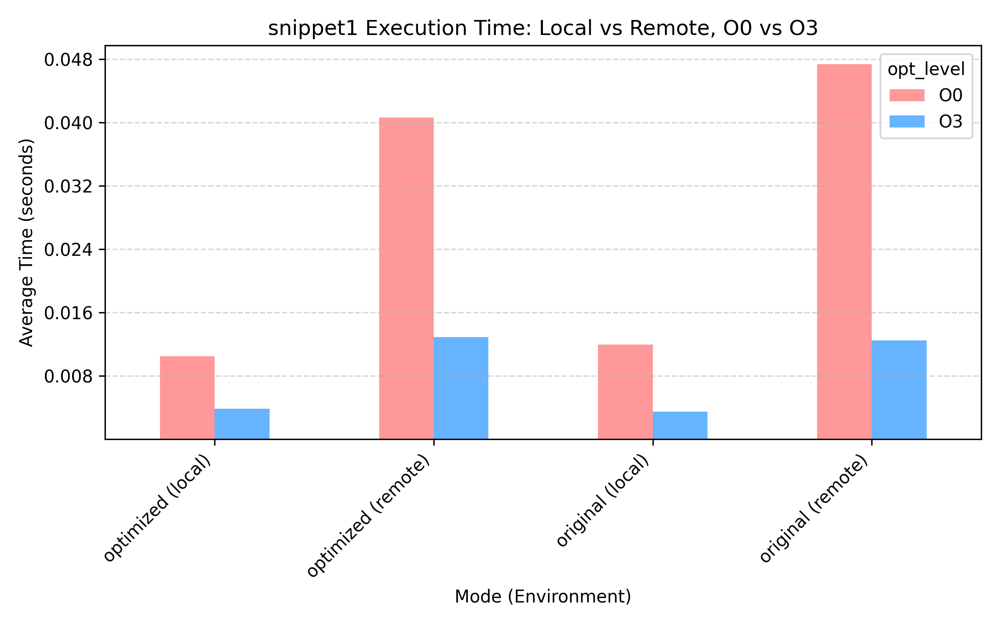
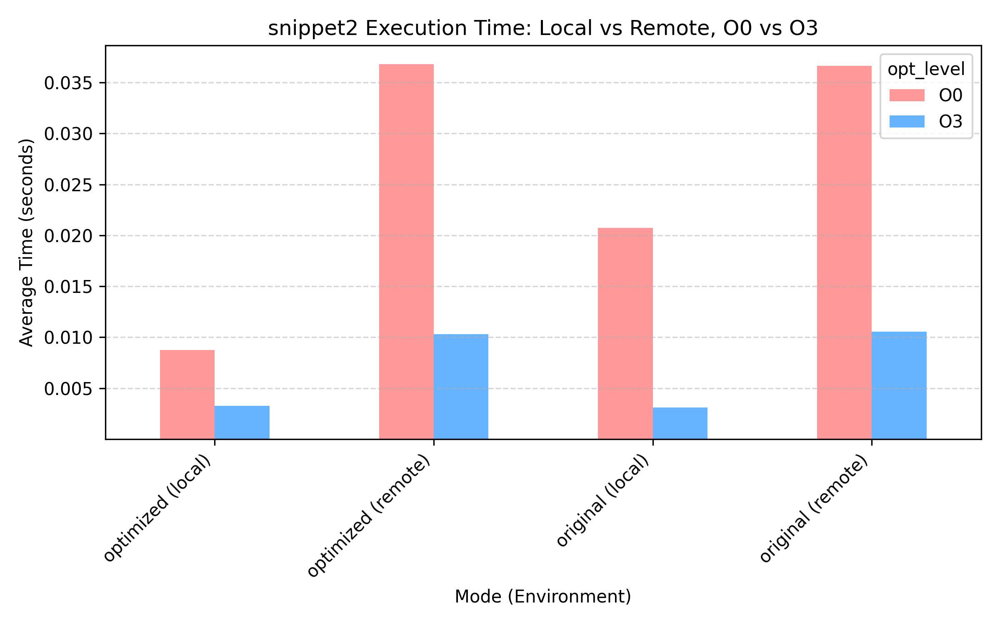
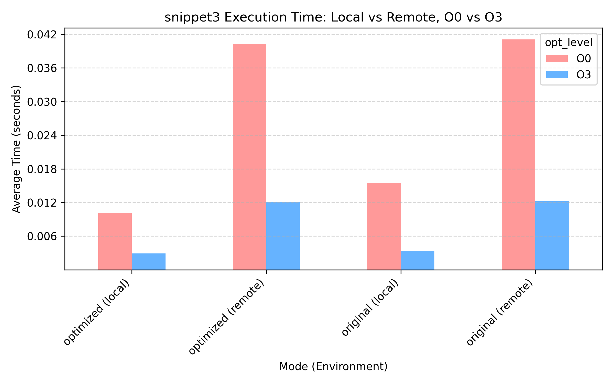
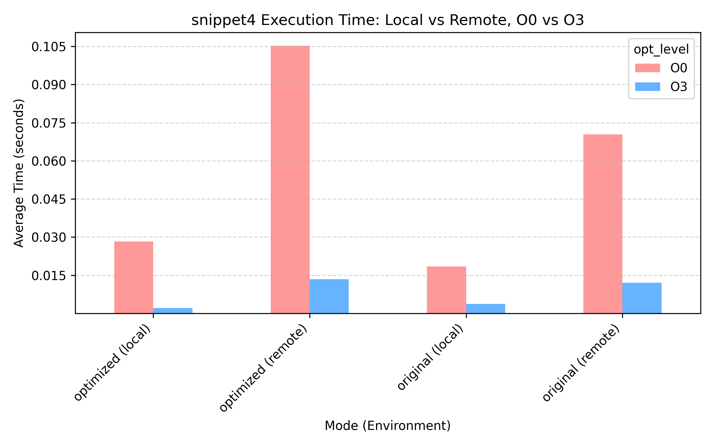
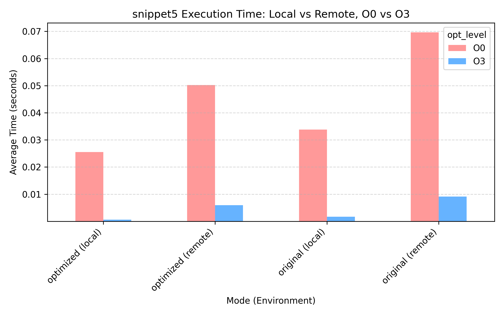
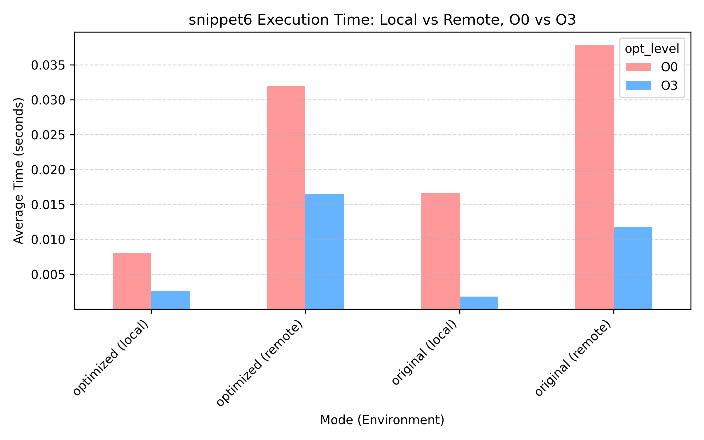
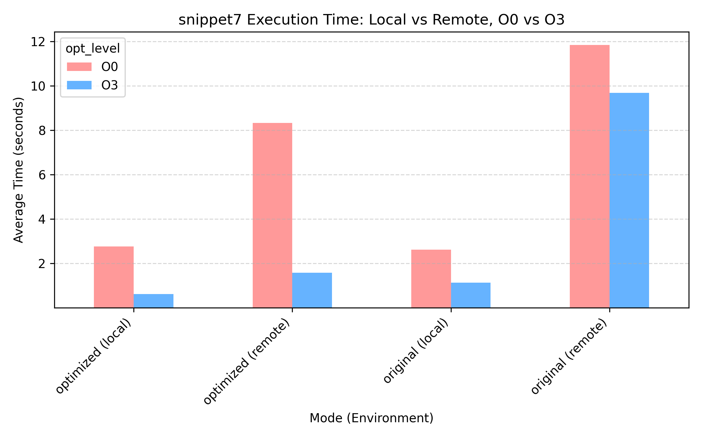

### Explanation for timing behaviour

- Some optimizations are already in -O0, so the original and optimized versions dont differ much for that optimization level.
- More complicated optimisations can sometimes be done by O3, but often optimization can just be done with knowledge of the input into the functions.
- Testing the code in the main function would maybe change results as the input is clearer.


### Timing Results

Here are the timing results for each snippet:


## Snippet 1
```c
void original(int *a, const int *b) {
    for (int i = 0; i < N - 1; ++i) {
        a[i] = b[i] + b[i + 1];
    }
}

// Incorrect loop unrolling – kept as-is for demonstration
void optimized(int *a, const int *b) {
    for (int i = 0; i < N - 2; i += 2) {
        a[i] = b[i] + b[i + 1];
        a[i + 1] = b[i + 1] + b[i + 2];
    }
}
```


- The compiler doesnt unroll as it has now knowledge if N odd/even.

## Snippet 2
```c
void process_array_hypot_original(double *a) {
    for (int i = 0; i < N; ++i) {
      a[i] *= hypot(0.3, 0.4);
  }
}

void process_array_hypot_optimized(double *a) {
  double hyp = hypot(0.3, 0.4);
    for (int i = 0; i < N; ++i) {
        a[i] *= hyp;
    }
}
```


- Compiler seems to do something similar according to the values.


## Snippet 3
```c
void process_array_conditional_original(int *a, const int *b, const int *c, int array_size) {
    for (int i = 0; i < array_size; ++i) {
        if (array_size % 2) {
            a[i] = b[i] + 5;
        } else {
            a[i] = c[i] + 5;
        }
    }
}

// Your task: Create an optimized version here
void process_array_conditional_optimized(int *a, const int *b, const int *c, int array_size) {
    // Hint: Look at the condition `if (array_size % 2)`. Does it change during the loop?
    if (array_size % 2) {
        for (int i = 0; i < array_size; ++i) {
            a[i] = b[i] + 5;
        }
    } else {
        for (int i = 0; i < array_size; ++i) {
            a[i] = c[i] + 5;
        }
    }
}
```



- Compiler seems to do something similar according to the values.

## Snippet 4
```c
void sum_arrays_optimized(const int *a, const int *b, const int *c, long long *sum_a, long long *sum_b, long long *sum_c) {
    *sum_a = 0;
    *sum_b = 0;
    *sum_c = 0;

    for (int i = 0; i < N_SUMS; ++i) {
        *sum_a += a[i];

    }
    for (int i = 0; i < N_SUMS; ++i) {

        *sum_b += b[i];

    }
    for (int i = 0; i < N_SUMS; ++i) {

        *sum_c += c[i];
    }
}
```



- Compiler doesnt seem to optimize so much bc it depends if a, b and c are different

## Snippet 5
```c
void min_and_sum_original(const int *a, int *min_val, long long *sum_val) {
    *min_val = a[0];
    *sum_val = 0;
    for (int i = 1; i < N_MIN_SUM; ++i) {
        *min_val = (a[i] < *min_val) ? a[i] : *min_val;
    }

    for (int i = 0; i < N_MIN_SUM; ++i) {
        *sum_val += a[i];
    }
}

void min_and_sum_optimized(const int *a, int *min_val, long long *sum_val) {
    // You will implement your optimization here
    *min_val = a[0];
    *sum_val = a[0];
    for (int i = 1; i < N_MIN_SUM; ++i) {
        *min_val = (a[i] < *min_val) ? a[i] : *min_val;
        *sum_val += a[i];
    }
}
```


- This depends on the unequality/equality of sum and min

## Snippet 6
```c
void process_array_original(int *a, const int *b, const int *c) {
    for (int i = 0; i < N; i++) {
        if (i % 2) {
            a[i] = b[i] + 4;
        } else {
            a[i] = c[i] + 5;
        }
  }
    
}

void process_array_splitted(int *a, const int *b, const int *c) {
  for (int i = 0; i < N; i += 2) {
            a[i] = c[i] + 5;
    }
  for (int i = 1; i < N; i += 2) {
            a[i] = b[i] + 4;
    }
}

```



## Snippet 7
```c
void matrix_multiply_original(double **c, double **a, double **b) {
    for (int i = 0; i < N; ++i) {
        for (int j = 0; j < N; ++j) {
            c[i][j] = 0;
            for (int k = 0; k < N; ++k) {
                c[i][j] += a[i][k] * b[k][j];
            }
        }
    }
}

void matrix_multiply_optimized(double **c, double **a, double **b) {
    for (int ic = 0; ic < N; ic += BLOCK_SIZE) {
        for (int jc = 0; jc < N; jc += BLOCK_SIZE) {
            for (int kc = 0; kc < N; kc += BLOCK_SIZE) {
                for (int i = ic; i < min(ic + BLOCK_SIZE, N); ++i) {
                    for (int j = jc; j < min(jc + BLOCK_SIZE, N); ++j) {
                        if (kc == 0) {
                            c[i][j] = 0;
                        }
                        for (int k = kc; k < min(kc + BLOCK_SIZE, N); ++k) {
                            c[i][j] += a[i][k] * b[k][j];
                        }
                    }
                }
            }
        }
    }
}
```



These plots visualize the performance of different code optimizations.
